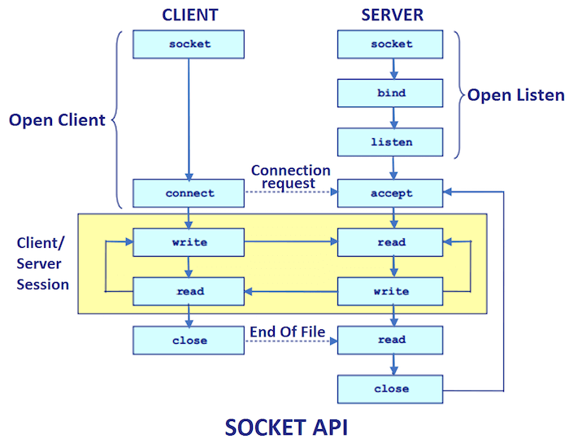
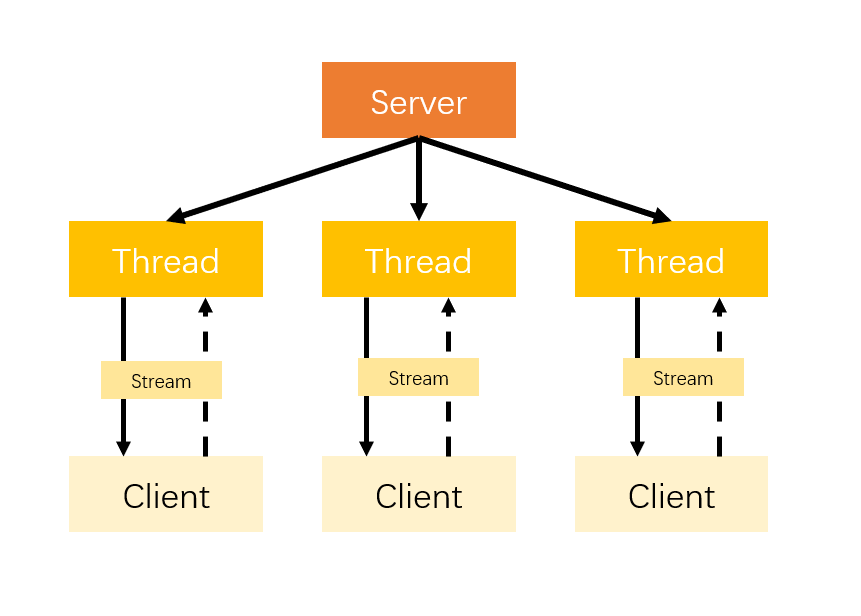
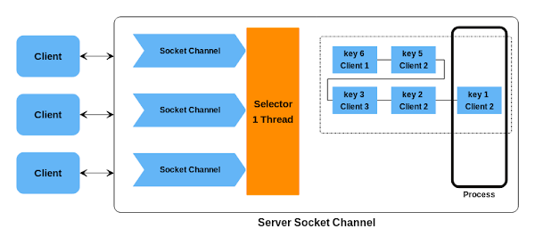
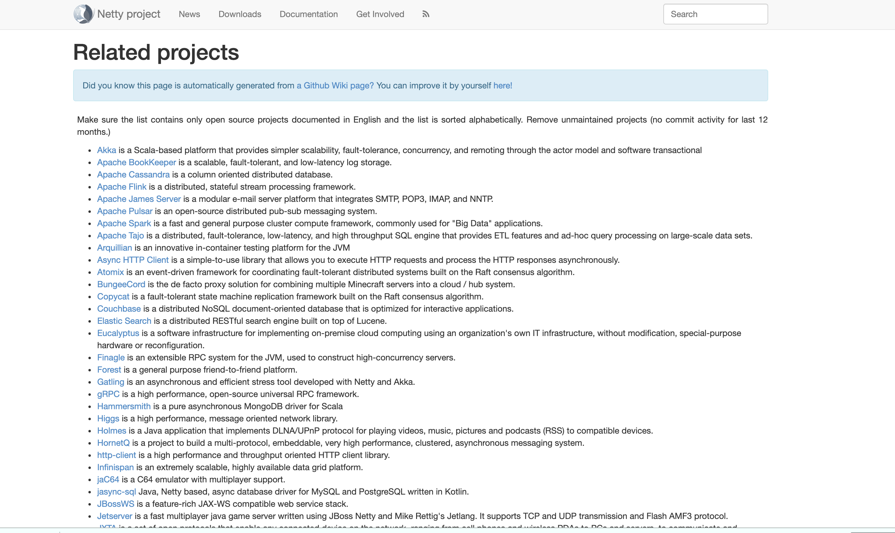

[大家好，我是 **「后端技术进阶」** 作者，一个热爱技术的少年。](https://www.yuque.com/docs/share/aaa50642-c892-4c41-8c0c-9d2fc2b0d93c?#%20%E3%80%8A%E8%B5%B0%E8%BF%9B%E5%90%8E%E7%AB%AF%E6%8A%80%E6%9C%AF%E8%BF%9B%E9%98%B6%E3%80%8B)

<!-- @import "[TOC]" {cmd="toc" depthFrom=1 depthTo=6 orderedList=false} -->

<!-- code_chunk_output -->

- [还是要从 BIO 说起](#还是要从-bio-说起)
  - [传统的阻塞式通信流程](#传统的阻塞式通信流程)
  - [一个简单的 demo](#一个简单的-demo)
  - [资源消耗严重的问题](#资源消耗严重的问题)
  - [线程池虽可以改善，但终究未从根本解决问题](#线程池虽可以改善但终究未从根本解决问题)
- [再看 NIO](#再看-nio)
  - [初识 NIO](#初识-nio)
  - [NIO 核心组件解读](#nio-核心组件解读)
  - [NIO 为啥更好？](#nio-为啥更好)
  - [使用 NIO 编写代码太难了](#使用-nio-编写代码太难了)
- [重要角色 Netty 登场](#重要角色-netty-登场)
- [Netty 特点](#netty-特点)
- [使用 Netty 能做什么？](#使用-netty-能做什么)
- [哪些开源项目用到了 Netty？](#哪些开源项目用到了-netty)
- [后记](#后记)

<!-- /code_chunk_output -->

> 觉得不错的话，欢迎 star！ღ( ´･ᴗ･` )比心
>
> - Netty 从入门到实战系列文章地址：[https://github.com/Snailclimb/netty-practical-tutorial](https://github.com/Snailclimb/netty-practical-tutorial) 。
> - RPC 框架源码地址：[https://github.com/Snailclimb/guide-rpc-framework](https://github.com/Snailclimb/guide-rpc-framework)

老套路，学习某一门技术或者框架的时候，第一步当然是要了解下面这几样东西。

1. 是什么？
2. 有哪些特点？
3. 有哪些应用场景？
4. 有哪些成功使用的案例？
5. .....

为了让你更好地了解 Netty 以及它诞生的原因，先从传统的网络编程说起吧！

## 还是要从 BIO 说起

### 传统的阻塞式通信流程

**早期的 Java 网络相关的 API(`java.net`包) 使用 Socket(套接字)进行网络通信，不过只支持阻塞函数使用。**

要通过互联网进行通信，至少需要一对套接字：

1. 运行于服务器端的 Server Socket。
2. 运行于客户机端的 Client Socket

Socket 网络通信过程如下图所示：



<p style="text-align:right;font-size:13px;color:gray">https://www.javatpoint.com/socket-programming</p>

**Socket 网络通信过程简单来说分为下面 4 步：**

1. 建立服务端并且监听客户端请求
2. 客户端请求，服务端和客户端建立连接
3. 两端之间可以传递数据
4. 关闭资源

对应到服务端和客户端的话，是下面这样的。

**服务器端：**

1. 创建 `ServerSocket` 对象并且绑定地址（ip）和端口号(port)：` server.bind(new InetSocketAddress(host, port))`
2. 通过 `accept()`方法监听客户端请求
3. 连接建立后，通过输入流读取客户端发送的请求信息
4. 通过输出流向客户端发送响应信息
5. 关闭相关资源

**客户端：**

1. 创建`Socket` 对象并且连接指定的服务器的地址（ip）和端口号(port)：`socket.connect(inetSocketAddress)`
2. 连接建立后，通过输出流向服务器端发送请求信息
3. 通过输入流获取服务器响应的信息
4. 关闭相关资源  

### 一个简单的 demo

**为了便于理解，我写了一个简单的代码帮助各位小伙伴理解。**

**服务端：**

```java
public class HelloServer {
    private static final Logger logger = LoggerFactory.getLogger(HelloServer.class);

    public void start(int port) {
        //1.创建 ServerSocket 对象并且绑定一个端口
        try (ServerSocket server = new ServerSocket(port);) {
            Socket socket;
            //2.通过 accept()方法监听客户端请求， 这个方法会一直阻塞到有一个连接建立
            while ((socket = server.accept()) != null) {
                logger.info("client connected");
                try (ObjectInputStream objectInputStream = new ObjectInputStream(socket.getInputStream());
                     ObjectOutputStream objectOutputStream = new ObjectOutputStream(socket.getOutputStream())) {
                   //3.通过输入流读取客户端发送的请求信息
                    Message message = (Message) objectInputStream.readObject();
                    logger.info("server receive message:" + message.getContent());
                    message.setContent("new content");
                    //4.通过输出流向客户端发送响应信息
                    objectOutputStream.writeObject(message);
                    objectOutputStream.flush();
                } catch (IOException | ClassNotFoundException e) {
                    logger.error("occur exception:", e);
                }
            }
        } catch (IOException e) {
            logger.error("occur IOException:", e);
        }
    }

    public static void main(String[] args) {
        HelloServer helloServer = new HelloServer();
        helloServer.start(6666);
    }
}

```

`ServerSocket` 的 `accept（）` 方法是阻塞方法，也就是说 `ServerSocket` 在调用 `accept（)`等待客户端的连接请求时会阻塞，直到收到客户端发送的连接请求才会继续往下执行代码，因此我们需要要为每个 Socket 连接开启一个线程（可以通过线程池来做）。

上述服务端的代码只是为了演示，并没有考虑多个客户端连接并发的情况。

**客户端：**

```java
/**
 * @author shuang.kou
 * @createTime 2020年05月11日 16:56:00
 */
public class HelloClient {

    private static final Logger logger = LoggerFactory.getLogger(HelloClient.class);

    public Object send(Message message, String host, int port) {
        //1. 创建Socket对象并且指定服务器的地址和端口号
        try (Socket socket = new Socket(host, port)) {
            ObjectOutputStream objectOutputStream = new ObjectOutputStream(socket.getOutputStream());
            //2.通过输出流向服务器端发送请求信息
            objectOutputStream.writeObject(message);
            //3.通过输入流获取服务器响应的信息
            ObjectInputStream objectInputStream = new ObjectInputStream(socket.getInputStream());
            return objectInputStream.readObject();
        } catch (IOException | ClassNotFoundException e) {
            logger.error("occur exception:", e);
        }
        return null;
    }

    public static void main(String[] args) {
        HelloClient helloClient = new HelloClient();
        Message message = (Message) helloClient.send(new Message("content from client"), "127.0.0.1", 6666);
        System.out.println("client receive message:" + message.getContent());
    }
}
```

**发送的消息实体类**：

```java
/**
 * @author shuang.kou
 * @createTime 2020年05月11日 17:02:00
 */
@Data
@AllArgsConstructor
public class Message implements Serializable {

    private String content;
}
```

**首先运行服务端，然后再运行客户端，控制台输出如下：**

服务端:

```
[main] INFO github.javaguide.socket.HelloServer - client connected
[main] INFO github.javaguide.socket.HelloServer - server receive message:content from client
```

客户端：

```
client receive message:new content
```

### 资源消耗严重的问题

很明显，我上面演示的代码片段有一个很严重的问题：**只能同时处理一个客户端的连接，如果需要管理多个客户端的话，就需要为我们请求的客户端单独创建一个线程。** 如下图所示：



对应的 Java 代码可能是下面这样的：

```java
new Thread(() -> {
   // 创建 socket 连接
}).start();
```

但是，这样会导致一个很严重的问题：**资源浪费**。

我们知道线程是很宝贵的资源，如果我们为每一次连接都用一个线程处理的话，就会导致线程越来越好，最好达到了极限之后，就无法再创建线程处理请求了。处理的不好的话，甚至可能直接就宕机掉了。

很多人就会问了：那有没有改进的方法呢？

### 线程池虽可以改善，但终究未从根本解决问题

当然有！ 比较简单并且实际的改进方法就是使用线程池。线程池还可以让线程的创建和回收成本相对较低，并且我们可以指定线程池的可创建线程的最大数量，这样就不会导致线程创建过多，机器资源被不合理消耗。

```java
ThreadFactory threadFactory = Executors.defaultThreadFactory();
ExecutorService threadPool = new ThreadPoolExecutor(10, 100, 1, TimeUnit.MINUTES, new ArrayBlockingQueue<>(100), threadFactory);
threadPool.execute(() -> {
     // 创建 socket 连接
 });
```

**但是，即使你再怎么优化和改变。也改变不了它的底层仍然是同步阻塞的 BIO 模型的事实，因此无法从根本上解决问题。**

**为了解决上述的问题，Java 1.4 中引入了 NIO ，一种同步非阻塞的 I/O 模型。**

## 再看 NIO

**Netty 实际上就基于 Java NIO 技术封装完善之后得到一个高性能框架，熟悉 NIO 的基本概念对于学习和更好地理解 Netty 还是很有必要的！**

### 初识 NIO

**NIO 是一种同步非阻塞的 I/O 模型，在 Java 1.4 中引入了 NIO 框架，对应 `java.nio` 包，提供了 Channel , Selector，Buffer 等抽象。**

**NIO 中的 N 可以理解为 Non-blocking，已经不在是 New 了（已经出来很长时间了）。**

NIO 支持面向缓冲(Buffer)的，基于通道(Channel)的 I/O 操作方法。

NIO 提供了与传统 BIO 模型中的 `Socket` 和 `ServerSocket` 相对应的 `SocketChannel` 和 `ServerSocketChannel` 两种不同的套接字通道实现,两种通道都支持阻塞和非阻塞两种模式：

1. **阻塞模式** : 基本不会被使用到。使用起来就像传统的网络编程一样，比较简单，但是性能和可靠性都不好。对于低负载、低并发的应用程序，勉强可以用一下以提升开发速率和更好的维护性
2. **非阻塞模式** ： 与阻塞模式正好相反，非阻塞模式对于高负载、高并发的（网络）应用来说非常友好，但是编程麻烦，这个是大部分人诟病的地方。所以， 也就导致了 Netty 的诞生。

### NIO 核心组件解读

NIO 包含下面几个核心的组件：

- **Channel**
- **Buffer**
- **Selector**
- **Selection Key**

**这些组件之间的关系是怎么的呢？**



<p style="text-align:right;font-size:12px">http://sergiomartinrubio.com/articles/java-socket-io-and-nio<p>

1. NIO 使用 Channel(通道)和 Buffer(缓冲区)传输数据，数据总是从缓冲区写入通道，并从通道读取到缓冲区。**在面向流的 I/O 中，可以将数据直接写入或者将数据直接读到 Stream 对象中。在 NIO 库中，所有数据都是通过 Buffer(缓冲区)处理的**。 Channel 可以看作是 Netty 的网络操作抽象类，对应于 JDK 底层的 Socket
2. NIO 利用 Selector （选择器）来监视多个通道的对象，如数据到达，连接打开等。因此，单线程可以监视多个通道中的数据。
3. 当我们将 Channel 注册到 Selector 中的时候, 会返回一个 Selection Key 对象, Selection Key 则表示了一个特定的通道对象和一个特定的选择器对象之间的注册关系。通过 Selection Key 我们可以获取哪些 IO 事件已经就绪了，并且可以通过其获取 Channel 并对其进行操作。

**Selector（选择器，也可以理解为多路复用器）是 NIO（非阻塞 IO）实现的关键。它使用了事件通知相关的 API 来实现选择已经就绪也就是能够进行 I/O 相关的操作的任务的能力。**

简单来说，整个过程是这样的：

1. 将 Channel 注册到 Selector 中。
2. 调用 Selector 的 `select()` 方法，这个方法会阻塞；
3. 到注册在 Selector 中的某个 Channel 有新的 TCP 连接或者可读写事件的话，这个 Channel 就会处于就绪状态，会被 Selector 轮询出来。
4. 然后通过 SelectionKey 可以获取就绪 Channel 的集合，进行后续的 I/O 操作。

### NIO 为啥更好？

**相比于传统的 BIO 模型来说， NIO 模型的最大改进是：**

1. 使用比较少的线程便可以管理多个客户端的连接，提高了并发量并且减少的资源消耗（减少了线程的上下文切换的开销）
2. 在没有 I/O 操作相关的事情的时候，线程可以被安排在其他任务上面，以让线程资源得到充分利用。

### 使用 NIO 编写代码太难了

一个使用 NIO 编写的 Server 端如下，可以看出还是整体还是比较复杂的，并且代码读起来不是很直观，并且还可能由于 NIO 本身会存在 Bug。

很少使用 NIO，很大情况下也是因为使用 NIO 来创建正确并且安全的应用程序的开发成本和维护成本都比较大。所以，一般情况下我们都会使用 Netty 这个比较成熟的高性能框架来做（Apace Mina 与之类似，但是 Netty 使用的更多一点）。


## 重要角色 Netty 登场

简单用 3 点概括一下 Netty 吧！

1. **Netty 是一个基于 NIO 的 client-server(客户端服务器)框架，使用它可以快速简单地开发网络应用程序。**
2. 它极大地简化并简化了 TCP 和 UDP 套接字服务器等网络编程,并且性能以及安全性等很多方面甚至都要更好。
3. 支持多种协议如 FTP，SMTP，HTTP 以及各种二进制和基于文本的传统协议。

用官方的总结就是：**Netty 成功地找到了一种在不妥协可维护性和性能的情况下实现易于开发，性能，稳定性和灵活性的方法。**

## Netty 特点

根据官网的描述，我们可以总结出下面一些特点：

- 统一的 API，支持多种传输类型，阻塞和非阻塞的。
- 简单而强大的线程模型。
- 自带编解码器解决 TCP 粘包/拆包问题。
- 自带各种协议栈。
- 真正的无连接数据包套接字支持。
- 比直接使用 Java 核心 API 有更高的吞吐量、更低的延迟、更低的资源消耗和更少的内存复制。
- 安全性不错，有完整的 SSL/TLS 以及 StartTLS 支持。
- 社区活跃
- 成熟稳定，经历了大型项目的使用和考验，而且很多开源项目都使用到了 Netty 比如我们经常接触的 Dubbo、RocketMQ 等等。
- ......

## Netty架构总览

下面是Netty的模块设计部分：


Netty提供了通用的传输API（TCP/UDP...）；多种网络协议（HTTP/WebSocket...）；基于事件驱动的IO模型；
超高性能的零拷贝...

上面说的这些模块和功能只是Netty的一部分，具体的组件在后面的部分会有较为详细的介绍。

## 使用 Netty 能做什么？

这个应该是老铁们最关心的一个问题了，凭借自己的了解，简单说一下，理论上 NIO 可以做的事情 ，使用 Netty 都可以做并且更好。Netty 主要用来做**网络通信** :

1. **作为 RPC 框架的网络通信工具** ： 我们在分布式系统中，不同服务节点之间经常需要相互调用，这个时候就需要 RPC 框架了。不同服务指点的通信是如何做的呢？可以使用 Netty 来做。比如我调用另外一个节点的方法的话，至少是要让对方知道我调用的是哪个类中的哪个方法以及相关参数吧！
2. **实现一个自己的 HTTP 服务器** ：通过 Netty 我们可以自己实现一个简单的 HTTP 服务器，这个大家应该不陌生。说到 HTTP 服务器的话，作为 Java 后端开发，我们一般使用 Tomcat 比较多。一个最基本的 HTTP 服务器可要以处理常见的 HTTP Method 的请求，比如 POST 请求、GET 请求等等。
3. **实现一个即时通讯系统** ： 使用 Netty 我们可以实现一个可以聊天类似微信的即时通讯系统，这方面的开源项目还蛮多的，可以自行去 Github 找一找。
4. **消息推送系统** ：市面上有很多消息推送系统都是基于 Netty 来做的。
5. ......

## 哪些开源项目用到了 Netty？

我们平常经常接触的 Dubbo、RocketMQ、Elasticsearch、gRPC 等等都用到了 Netty。

可以说大量的开源项目都用到了 Netty，所以掌握 Netty 有助于你更好的使用这些开源项目并且让你有能力对其进行二次开发。

实际上还有很多很多优秀的项目用到了 Netty,Netty 官方也做了统计，统计结果在这里：[https://netty.io/wiki/related-projects.html](https://netty.io/wiki/related-projects.html) 。



## Netty 学习指南

学习Netty，相信大部分小伙伴都会选择 《Netty in Action》 和  《Netty 4.x User Guide 》，
这里我推荐它们的通读版本，这二本书的通读版本的作者都为同一人，通读版本对《Netty in Action》做出了更为精简的概述，
所以各位小伙伴可酌情挑选阅读。

- [《Netty in Action》](https://waylau.com/essential-netty-in-action/index.html)

- [《Netty 4.x User Guide》](https://waylau.gitbooks.io/netty-4-user-guide/content)

其次我认为只看书是不够的，这里我推荐一些关于Netty入门比较优秀的视频供各位小伙伴参考，
推荐视频观看的顺序即下列顺序，各位小伙伴不需要每个视频的每个章节都看，只需要挑选互补的内容学习即可：

- [韩顺平Netty教程](https://www.bilibili.com/video/BV1DJ411m7NR)

- [张龙Netty教程](https://www.bilibili.com/video/BV1cb411F7En)

- [索南杰夕Netty RPC实现](https://www.bilibili.com/video/BV1Rb411h7jZ)

最后，在学习Netty之前，我们需要对 IO模型(网络IO模型)有一个大概的认知。

## 后记

RPC 框架源码已经开源了,地址：[https://github.com/Snailclimb/guide-rpc-framework](https://github.com/Snailclimb/guide-rpc-framework)

Guide 的星球正在更新《从零开始手把手教你实现一个简单的 RPC 框架》。

扫描下方二维码关注“JavaGuide”后回复 “星球”。

