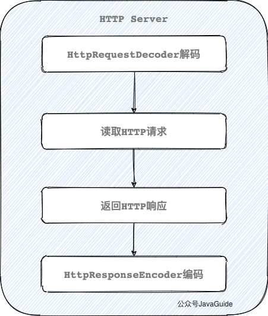
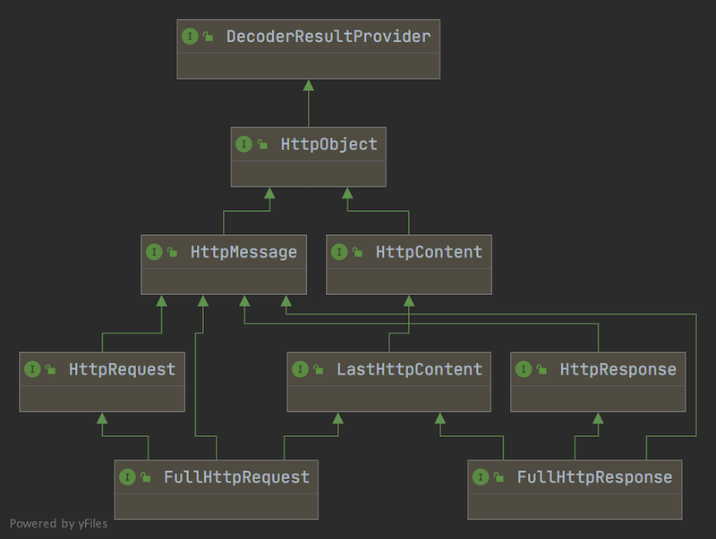
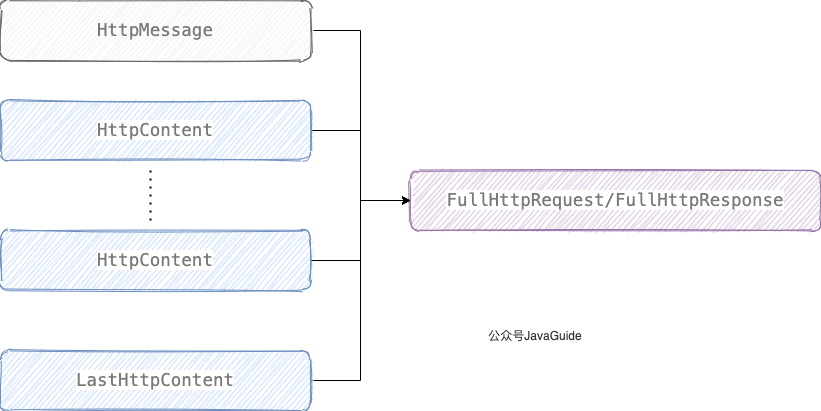

>本文已经收录进 : [https://github.com/Snailclimb/netty-practical-tutorial](https://github.com/Snailclimb/netty-practical-tutorial) (Netty从入门到实战：手写HTTP Server+RPC框架)。

目前正在写的一个叫做 [jsoncat](https://github.com/Snailclimb/jsoncat) 的轻量级 HTTP 框架内置的 HTTP 服务器是我自己基于 Netty 写的，所有的核心代码加起来不过就几十行。这得益于 Netty 提供的各种开箱即用的组件，为我们节省了太多事情。

这篇文章我会手把手带着小伙伴们实现一个简易的 HTTP Server。

_如果文章有任何需要改善和完善的地方，欢迎在评论区指出，共同进步！_

开始之前为了避免有小伙伴不了解 Netty ，还是先来简单介绍它！

## 什么是 Netty？

简单用 3 点来概括一下 Netty 吧！

1. Netty 是一个基于 **NIO** 的 client-server(客户端服务器)框架，使用它可以快速简单地开发网络应用程序。
2. Netty 极大地简化并优化了 TCP 和 UDP 套接字服务器等网络编程,并且性能以及安全性等很多方面都要更好。
3. Netty **支持多种协议** 如 FTP，SMTP，HTTP 以及各种二进制和基于文本的传统协议。本文所要写的 HTTP Server 就得益于 Netty 对 HTTP 协议（超文本传输协议）的支持。

## Netty 应用场景有哪些？

凭借自己的了解，简单说一下吧！理论上来说，NIO 可以做的事情 ，使用 Netty 都可以做并且更好。

不过，我们还是首先要明确的是 Netty 主要用来做**网络通信** 。

1. **实现框架的网络通信模块** ： Netty 几乎满足任何场景的网络通信需求，因此，框架的网络通信模块可以基于 Netty 来做。拿 RPC 框架来说！ 我们在分布式系统中，不同服务节点之间经常需要相互调用，这个时候就需要 RPC 框架了。不同服务指点的通信是如何做的呢？那就可以使用 Netty 来做了！比如我调用另外一个节点的方法的话，至少是要让对方知道我调用的是哪个类中的哪个方法以及相关参数吧！
2. **实现一个自己的 HTTP 服务器** ：通过 Netty ，我们可以很方便地使用少量代码实现一个简单的 HTTP 服务器。Netty 自带了编解码器和消息聚合器，为我们开发节省了很多事！
3. **实现一个即时通讯系统** ： 使用 Netty 我们可以实现一个可以聊天类似微信的即时通讯系统，这方面的开源项目还蛮多的，可以自行去 Github 找一找。
4. **实现消息推送系统** ：市面上有很多消息推送系统都是基于 Netty 来做的。
5. ......

## 那些开源项目用到了 Netty?

我们平常经常接触的 Dubbo、RocketMQ、Elasticsearch、gRPC 、Spring Cloud Gateway 等等都用到了 Netty。

可以说大量的开源项目都用到了 Netty，所以掌握 Netty 有助于你更好的使用这些开源项目并且让你有能力对其进行二次开发。

实际上还有很多很多优秀的项目用到了 Netty,Netty 官方也做了统计，统计结果在这里：https://netty.io/wiki/related-projects.html 。

## 实现 HTTP Server 必知的前置知识

既然，我们要实现 HTTP Server 那必然先要回顾一下 HTTP 协议相关的基础知识。

### HTTP 协议

**超文本传输协议（HTTP，HyperText Transfer Protocol)主要是为 Web 浏览器与 Web 服务器之间的通信而设计的。**

当我们使用浏览器浏览网页的时候，我们网页就是通过 HTTP 请求进行加载的，整个过程如下图所示。


<p style="text-align:right;font-size:12px">https://www.seobility.net/en/wiki/HTTP_headers</p>

**HTTP 协议是基于 TCP 协议的**，因此，发送 HTTP 请求之前首先要建立 TCP 连接也就是要经历 3 次握手。目前使用的 HTTP 协议大部分都是 1.1。在 1.1 的协议里面，默认是开启了 Keep-Alive 的，这样的话建立的连接就可以在多次请求中被复用了。

了解了 HTTP 协议之后，我们再来看一下 HTTP 报文的内容，这部分内容很重要！（参考图片来自：[https://iamgopikrishna.wordpress.com/2014/06/13/4/](https://iamgopikrishna.wordpress.com/2014/06/13/4/)）

**HTTP 请求报文：**


**HTTP 响应报文：**


**我们的 HTTP 服务器会在后台解析 HTTP 请求报文内容，然后根据报文内容进行处理之后返回 HTTP 响应报文给客户端。**

### Netty 编解码器

如果我们要通过 Netty 处理 HTTP 请求，需要先进行编解码。所谓编解码说白了就是在 Netty 传输数据所用的 `ByteBuf` 和 Netty 中针对 HTTP 请求和响应所提供的对象比如 `HttpRequest` 和 `HttpContent`之间互相转换。

Netty 自带了 4 个常用的编解码器：

1. `HttpRequestEncoder` （HTTP 请求编码器）：将 `HttpRequest` 和 `HttpContent` 编码为 `ByteBuf` 。
2. `HttpRequestDecoder` （HTTP 请求解码器）：将 `ByteBuf` 解码为 `HttpRequest` 和 `HttpContent`
3. `HttpResponsetEncoder` （HTTP 响应编码器）：将 `HttpResponse` 和 `HttpContent` 编码为 `ByteBuf` 。
4. `HttpResponseDecoder`（HTTP 响应解码器）：将 `ByteBuf` 解码为 `HttpResponst` 和 `HttpContent`

**网络通信最终都是通过字节流进行传输的。 `ByteBuf` 是 Netty 提供的一个字节容器，其内部是一个字节数组。** 当我们通过 Netty 传输数据的时候，就是通过 `ByteBuf` 进行的。

**HTTP Server 端用于接收 HTTP Request，然后发送 HTTP Response。因此我们只需要 `HttpRequestDecoder` 和 `HttpResponseEncoder` 即可。**

我手绘了一张图，这样看着应该更容易理解了。



### Netty 对 HTTP 消息的抽象

为了能够表示 HTTP 中的各种消息，Netty 设计了抽象了一套完整的 HTTP 消息结构图，核心继承关系如下图所示。



1. `HttpObject` : 整个 HTTP 消息体系结构的最上层接口。`HttpObject` 接口下又有 `HttpMessage` 和`HttpContent`两大核心接口。
2. `HttpMessage`: 定义 HTTP 消息，为`HttpRequest`和`HttpResponse`提供通用属性
3. `HttpRequest` : `HttpRequest`对应 HTTP request。通过 `HttpRequest` 我们可以访问查询参数（Query Parameters）和 Cookie。和 Servlet API 不同的是，查询参数是通过`QueryStringEncoder`和`QueryStringDecoder`来构造和解析查询查询参数。
4. `HttpResponse` ： `HttpResponse` 对应 HTTP response。和`HttpMessage`相比，`HttpResponse` 增加了 status（相应状态码） 属性及其对应的方法。
5. `HttpContent` : **分块传输编码**（**Chunked transfer encoding**）是超文本传输协议（HTTP）中的一种数据传输机制（HTTP/1.1 才有），允许 HTTP 由应用服务器发送给客户端应用（ 通常是网页浏览器）的数据可以分成多“块”（数据量比较大的情况）。我们可以把 `HttpContent` 看作是这一块一块的数据。
6. `LastHttpContent` : 标识 HTTP 请求结束，同时包含 `HttpHeaders` 对象。
7. `FullHttpRequest` 和 `FullHttpResponse` ： `HttpMessage` 和 `HttpContent` 聚合后得到的对象。



### HTTP 消息聚合器

`HttpObjectAggregator` 是 Netty 提供的 HTTP 消息聚合器，通过它可以把 `HttpMessage` 和 `HttpContent` 聚合成一个 `FullHttpRequest` 或者 `FullHttpResponse`(取决于是处理请求还是响应），方便我们使用。

另外，消息体比较大的话，可能还会分成好几个消息体来处理，`HttpObjectAggregator` 可以将这些消息聚合成一个完整的，方便我们处理。

使用方法：将 `HttpObjectAggregator` 添加到 `ChannelPipeline` 中，如果是用于处理 HTTP Request 就将其放在 `HttpResponseEncoder` 之后，反之，如果用于处理 HTTP Response 就将其放在 `HttpResponseDecoder` 之后。

因为，HTTP Server 端用于接收 HTTP Request，对应的使用方式如下。

```java
ChannelPipeline p = ...;
 p.addLast("decoder", new HttpRequestDecoder())
  .addLast("encoder", new HttpResponseEncoder())
  .addLast("aggregator", new HttpObjectAggregator(512 * 1024))
  .addLast("handler", new HttpServerHandler());
```

## 基于 Netty 实现一个 HTTP Server

**通过 Netty，我们可以很方便地使用少量代码构建一个可以正确处理 GET 请求和 POST 请求的轻量级 HTTP Server。**

源代码地址：[https://github.com/Snailclimb/netty-practical-tutorial/tree/master/example/http-server](https://github.com/Snailclimb/netty-practical-tutorial/tree/master/example/http-server) 。

### 添加所需依赖到pom.xml

第一步，我们需要将实现 HTTP Server 所必需的第三方依赖的坐标添加到 `pom.xml`中。

```xml
<!--netty-->
<dependency>
    <groupId>io.netty</groupId>
    <artifactId>netty-all</artifactId>
    <version>4.1.42.Final</version>
</dependency>
<!-- log -->
<dependency>
    <groupId>org.slf4j</groupId>
    <artifactId>slf4j-api</artifactId>
    <version>1.7.25</version>
</dependency>
<dependency>
    <groupId>org.slf4j</groupId>
    <artifactId>slf4j-simple</artifactId>
    <version>1.7.25</version>
</dependency>
<!-- lombok -->
<dependency>
    <groupId>org.projectlombok</groupId>
    <artifactId>lombok</artifactId>
    <version>1.18.8</version>
    <scope>provided</scope>
</dependency>
<!--commons-codec-->
<dependency>
    <groupId>commons-codec</groupId>
    <artifactId>commons-codec</artifactId>
    <version>1.14</version>
</dependency>
```

### 创建服务端

```java
@Slf4j
public class HttpServer {

    private static final int PORT = 8080;

    public void start() {
        EventLoopGroup bossGroup = new NioEventLoopGroup(1);
        EventLoopGroup workerGroup = new NioEventLoopGroup();
        try {
            ServerBootstrap b = new ServerBootstrap();
            b.group(bossGroup, workerGroup)
                    .channel(NioServerSocketChannel.class)
                    // TCP默认开启了 Nagle 算法，该算法的作用是尽可能的发送大数据快，减少网络传输。TCP_NODELAY 参数的作用就是控制是否启用 Nagle 算法。
                    .childOption(ChannelOption.TCP_NODELAY, true)
                    // 是否开启 TCP 底层心跳机制
                    .childOption(ChannelOption.SO_KEEPALIVE, true)
                    //表示系统用于临时存放已完成三次握手的请求的队列的最大长度,如果连接建立频繁，服务器处理创建新连接较慢，可以适当调大这个参数
                    .option(ChannelOption.SO_BACKLOG, 128)
                    .handler(new LoggingHandler(LogLevel.INFO))
                    .childHandler(new ChannelInitializer<SocketChannel>() {
                        @Override
                        protected void initChannel(SocketChannel ch) {
                            ch.pipeline().addLast("decoder", new HttpRequestDecoder())
                                    .addLast("encoder", new HttpResponseEncoder())
                                    .addLast("aggregator", new HttpObjectAggregator(512 * 1024))
                                    .addLast("handler", new HttpServerHandler());
                        }
                    });
            Channel ch = b.bind(PORT).sync().channel();
            log.info("Netty Http Server started on port {}.", PORT);
            ch.closeFuture().sync();
        } catch (InterruptedException e) {
            log.error("occur exception when start server:", e);
        } finally {
            log.error("shutdown bossGroup and workerGroup");
            bossGroup.shutdownGracefully();
            workerGroup.shutdownGracefully();
        }
    }
}
```

简单解析一下服务端的创建过程具体是怎样的!

**1.创建了两个 `NioEventLoopGroup` 对象实例：`bossGroup` 和 `workerGroup`。**

- `bossGroup` : 用于处理客户端的 TCP 连接请求。
- `workerGroup` ： 负责每一条连接的具体读写数据的处理逻辑，真正负责 I/O 读写操作，交由对应的 Handler 处理。

举个例子：我们把公司的老板当做 bossGroup，员工当做 workerGroup，bossGroup 在外面接完活之后，扔给 workerGroup 去处理。一般情况下我们会指定 bossGroup 的 线程数为 1（并发连接量不大的时候） ，workGroup 的线程数量为 **CPU 核心数 \*2** 。另外，根据源码来看，使用 `NioEventLoopGroup` 类的无参构造函数设置线程数量的默认值就是 **CPU 核心数 \*2** 。

**2.创建一个服务端启动引导/辅助类： `ServerBootstrap`，这个类将引导我们进行服务端的启动工作。**

**3.通过 `.group()` 方法给引导类 `ServerBootstrap` 配置两大线程组，确定了线程模型。**

**4.通过`channel()`方法给引导类 `ServerBootstrap`指定了 IO 模型为`NIO`**

- `NioServerSocketChannel` ：指定服务端的 IO 模型为 NIO，与 BIO 编程模型中的`ServerSocket`对应
- `NioSocketChannel` : 指定客户端的 IO 模型为 NIO， 与 BIO 编程模型中的`Socket`对应

**5.通过 `.childHandler()`给引导类创建一个`ChannelInitializer` ，然后指定了服务端消息的业务处理逻辑也就是自定义的`ChannelHandler` 对象**

**6.调用 `ServerBootstrap` 类的 `bind()`方法绑定端口** 。

```java
//bind()是异步的，但是，你可以通过 sync()方法将其变为同步。
ChannelFuture f = b.bind(port).sync();
```

### 自定义服务端 ChannelHandler 处理 HTTP 请求

我们继承`SimpleChannelInboundHandler` ,并重写下面 3 个方法：

1. `channelRead()` ：服务端接收并处理客户端发送的 HTTP 请求调用的方法。
2. `exceptionCaught()` ：处理客户端发送的 HTTP 请求发生异常的时候被调用。
3. `channelReadComplete()` : 服务端消费完客户端发送的 HTTP 请求之后调用的方法。

另外，客户端 HTTP 请求参数类型为 `FullHttpRequest`。我们可以把 `FullHttpRequest`对象看作是 HTTP 请求报文的 Java 对象的表现形式。

```java
@Slf4j
public class HttpServerHandler extends SimpleChannelInboundHandler<FullHttpRequest> {
    private static final String FAVICON_ICO = "/favicon.ico";
    private static final AsciiString CONNECTION = AsciiString.cached("Connection");
    private static final AsciiString KEEP_ALIVE = AsciiString.cached("keep-alive");
    private static final AsciiString CONTENT_TYPE = AsciiString.cached("Content-Type");
    private static final AsciiString CONTENT_LENGTH = AsciiString.cached("Content-Length");

    @Override
    protected void channelRead0(ChannelHandlerContext ctx, FullHttpRequest fullHttpRequest) {
        log.info("Handle http request:{}", fullHttpRequest);
        String uri = fullHttpRequest.uri();
        if (uri.equals(FAVICON_ICO)) {
            return;
        }
        RequestHandler requestHandler = RequestHandlerFactory.create(fullHttpRequest.method());
        Object result;
        FullHttpResponse response;
        try {
            result = requestHandler.handle(fullHttpRequest);
            String responseHtml = "<html><body>" + result + "</body></html>";
            byte[] responseBytes = responseHtml.getBytes(StandardCharsets.UTF_8);
            response = new DefaultFullHttpResponse(HTTP_1_1, OK, Unpooled.wrappedBuffer(responseBytes));
            response.headers().set(CONTENT_TYPE, "text/html; charset=utf-8");
            response.headers().setInt(CONTENT_LENGTH, response.content().readableBytes());
        } catch (IllegalArgumentException e) {
            e.printStackTrace();
            String responseHtml = "<html><body>" + e.toString() + "</body></html>";
            byte[] responseBytes = responseHtml.getBytes(StandardCharsets.UTF_8);
            response = new DefaultFullHttpResponse(HTTP_1_1, INTERNAL_SERVER_ERROR, Unpooled.wrappedBuffer(responseBytes));
            response.headers().set(CONTENT_TYPE, "text/html; charset=utf-8");
        }
        boolean keepAlive = HttpUtil.isKeepAlive(fullHttpRequest);
        if (!keepAlive) {
            ctx.write(response).addListener(ChannelFutureListener.CLOSE);
        } else {
            response.headers().set(CONNECTION, KEEP_ALIVE);
            ctx.write(response);
        }
    }


    @Override
    public void exceptionCaught(ChannelHandlerContext ctx, Throwable cause) {
        cause.printStackTrace();
        ctx.close();
    }

    @Override
    public void channelReadComplete(ChannelHandlerContext ctx) {
        ctx.flush();
    }

}
```

我们返回给客户端的消息体是 `FullHttpResponse` 对象。通过 `FullHttpResponse` 对象，我们可以设置 HTTP 响应报文的 HTTP 协议版本、响应的具体内容 等内容。

我们可以把 `FullHttpResponse` 对象看作是 HTTP 响应报文的 Java 对象的表现形式。

```java
FullHttpResponse response;

String responseHtml = "<html><body>" + result + "</body></html>";
byte[] responseBytes = responseHtml.getBytes(StandardCharsets.UTF_8);
// 初始化 FullHttpResponse ，并设置 HTTP 协议 、响应状态码、响应的具体内容
response = new DefaultFullHttpResponse(HTTP_1_1, OK, Unpooled.wrappedBuffer(responseBytes));
```

我们通过 `FullHttpResponse`的`headers()`方法获取到 `HttpHeaders`,这里的 `HttpHeaders` 对应于 HTTP 响应报文的头部。通过 `HttpHeaders`对象，我们就可以对 HTTP 响应报文的头部的内容比如 Content-Typ 进行设置。

```java
response.headers().set(CONTENT_TYPE, "text/html; charset=utf-8");
response.headers().setInt(CONTENT_LENGTH, response.content().readableBytes());
```

本案例中，为了掩饰我们设置的 Content-Type 为 `text/html` ，也就是返回 html 格式的数据给客户端。

**常见的 Content-Type**

| Content-Type     | 解释                            |
| ---------------- | ------------------------------- |
| text/html        | html 格式                       |
| text/plain       | 纯文本格式                      |
| text/css         | css 格式                        |
| text/javascript  | js 格式                         |
| application/json | json 格式（前后端分离项目常用） |
| image/gif        | gif 图片格式                    |
| image/jpeg       | jpg 图片格式                    |
| image/png        | png 图片格式                    |

### 请求的具体处理逻辑实现

因为有这里有 POST 请求和 GET 请求。因此我们需要首先定义一个处理 HTTP Request 的接口。

```java
public interface RequestHandler {
    Object handle(FullHttpRequest fullHttpRequest);
}
```

HTTP Method 不只是有 GET 和 POST，其他常见的还有 PUT、DELETE、PATCH。只是本案例中实现的 HTTP Server 只考虑了 GET 和 POST。

- GET ：请求从服务器获取特定资源。举个例子：`GET /classes`（获取所有班级）
- POST ：在服务器上创建一个新的资源。举个例子：`POST /classes`（创建班级）
- PUT ：更新服务器上的资源（客户端提供更新后的整个资源）。举个例子：`PUT /classes/12`（更新编号为 12 的班级）
- DELETE ：从服务器删除特定的资源。举个例子：`DELETE /classes/12`（删除编号为 12 的班级）
- PATCH ：更新服务器上的资源（客户端提供更改的属性，可以看做作是部分更新），使用的比较少，这里就不举例子了。

#### GET 请求的处理

```java
@Slf4j
public class GetRequestHandler implements RequestHandler {
    @Override
    public Object handle(FullHttpRequest fullHttpRequest) {
        String requestUri = fullHttpRequest.uri();
        Map<String, String> queryParameterMappings = this.getQueryParams(requestUri);
        return queryParameterMappings.toString();
    }

    private Map<String, String> getQueryParams(String uri) {
        QueryStringDecoder queryDecoder = new QueryStringDecoder(uri, Charsets.toCharset(CharEncoding.UTF_8));
        Map<String, List<String>> parameters = queryDecoder.parameters();
        Map<String, String> queryParams = new HashMap<>();
        for (Map.Entry<String, List<String>> attr : parameters.entrySet()) {
            for (String attrVal : attr.getValue()) {
                queryParams.put(attr.getKey(), attrVal);
            }
        }
        return queryParams;
    }

}
```

我这里只是简单得把 URI 的查询参数的对应关系直接返回给客户端了。

实际上，获得了 URI 的查询参数的对应关系，再结合反射和注解相关的知识，我们很容易实现类似于 Spring Boot 的 `@RequestParam` 注解了。

建议想要学习的小伙伴，可以自己独立实现一下。不知道如何实现的话，你可以参考我开源的轻量级 HTTP 框架[jsoncat](https://github.com/Snailclimb/jsoncat) （仿 Spring Boot 但不同于 Spring Boot 的一个轻量级的 HTTP 框架）。

#### POST 请求的处理

```java
@Slf4j
public class PostRequestHandler implements RequestHandler {

    @Override
    public Object handle(FullHttpRequest fullHttpRequest) {
        String requestUri = fullHttpRequest.uri();
        log.info("request uri :[{}]", requestUri);
        String contentType = this.getContentType(fullHttpRequest.headers());
        if (contentType.equals("application/json")) {
            return fullHttpRequest.content().toString(Charsets.toCharset(CharEncoding.UTF_8));
        } else {
            throw new IllegalArgumentException("only receive application/json type data");
        }

    }

    private String getContentType(HttpHeaders headers) {
        String typeStr = headers.get("Content-Type");
        String[] list = typeStr.split(";");
        return list[0];
    }
}

```

对于 POST 请求的处理，我们这里只接受处理 Content-Type 为 `application/json` 的数据，如果 POST 请求传过来的不是 `application/json` 类型的数据，我们就直接抛出异常。

实际上，我们获得了客户端传来的 json 格式的数据之后，再结合反射和注解相关的知识，我们很容易实现类似于 Spring Boot 的 `@RequestBody` 注解了。

建议想要学习的小伙伴，可以自己独立实现一下。不知道如何实现的话，你可以参考我开源的轻量级 HTTP 框架[jsoncat](https://github.com/Snailclimb/jsoncat) （仿 Spring Boot 但不同于 Spring Boot 的一个轻量级的 HTTP 框架）。

#### 请求处理工厂类

```java
public class RequestHandlerFactory {
    public static final Map<HttpMethod, RequestHandler> REQUEST_HANDLERS = new HashMap<>();

    static {
        REQUEST_HANDLERS.put(HttpMethod.GET, new GetRequestHandler());
        REQUEST_HANDLERS.put(HttpMethod.POST, new PostRequestHandler());
    }

    public static RequestHandler create(HttpMethod httpMethod) {
        return REQUEST_HANDLERS.get(httpMethod);
    }
}
```

我这里用到了工厂模式，当我们额外处理新的 HTTP Method 方法的时候，直接实现 `RequestHandler` 接口，然后将实现类添加到 `RequestHandlerFactory` 即可。

### 启动类

```java
public class HttpServerApplication {
    public static void main(String[] args) {
        HttpServer httpServer = new HttpServer();
        httpServer.start();
    }
}
```

### 效果

运行 `HttpServerApplication` 的`main()`方法，控制台打印出：

```bash
[nioEventLoopGroup-2-1] INFO io.netty.handler.logging.LoggingHandler - [id: 0x9bb1012a] REGISTERED
[nioEventLoopGroup-2-1] INFO io.netty.handler.logging.LoggingHandler - [id: 0x9bb1012a] BIND: 0.0.0.0/0.0.0.0:8080
[nioEventLoopGroup-2-1] INFO io.netty.handler.logging.LoggingHandler - [id: 0x9bb1012a, L:/0:0:0:0:0:0:0:0:8080] ACTIVE
[main] INFO server.HttpServer - Netty Http Server started on port 8080.
```

#### GET 请求


#### POST 请求


## 参考

1. [Netty 学习笔记-http objects](https://skyao.gitbooks.io/learning-netty/content/http/object/)